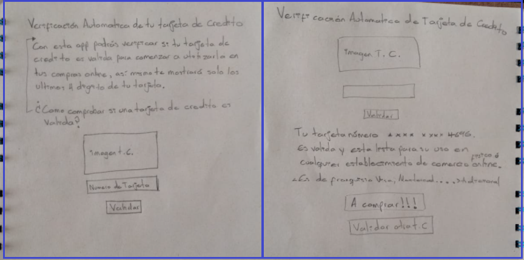
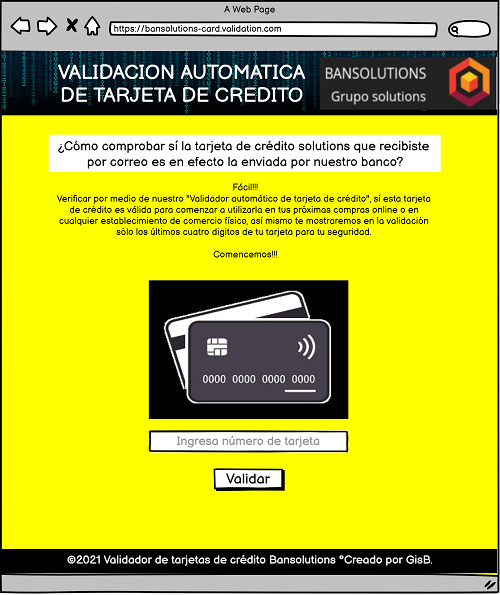
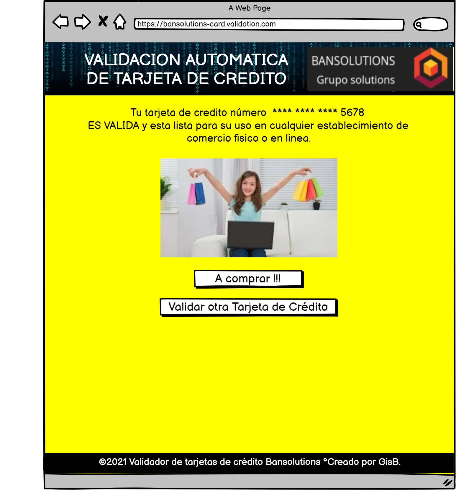

# Card Validation Project 1

## Índice

* [1. Resumen (Abstract)](#1-Resumen)
* [2. Imagen Final](#2-Imagen-Final)
* [3. Investigación UX (UX research)](#3-Investigación-UX)
* [3.1. Usuarios y Objetivos del Producto (User and product goals)](#4-usuarios-y-objetivos-del-producto)
* [3.2. Cómo el producto resuelve los problemas/necesidades del usuario (How the product solves user problems/requirement)](#5-como-el-producto-resuelve-el-problema)
* [3.3. Primer Prototipo en papel (First Paper prototyping)](#6-primer-prototipo-en-papel)
* [3.4. Retroalimentación de Usuarios (User Feedback)](#7-retroalimentacion-de-usuario)
* [3.5. Prototipo Final (Final Prototype)](#8-prototipo-final)

***

## 1. Resumen (Abstract)
xxxxxxxxxxxx

## 2. Imagen Final del Proyecto

## 3. Investigación UX (UX Research)

### 3.1. Usuarios y Objetivos del Producto (User and product goals)
xxxxxxxxxxxxxx

### 3.2. Cómo el producto resuelve los problemas/necesidades del usuario (How the product solves user problems/requirement)
xxxxxxxxxxxxxx

### 3.3. Primer Prototipo en papel (First Paper prototyping)

### 3.4. Retroalimentación de Usuarios (User Feedback)

xxxxxxxxxx

### 3.5. Prototipo Final (Final Prototype)

[imagen prototipo respuesta valida](img/validadornegativo.png)

