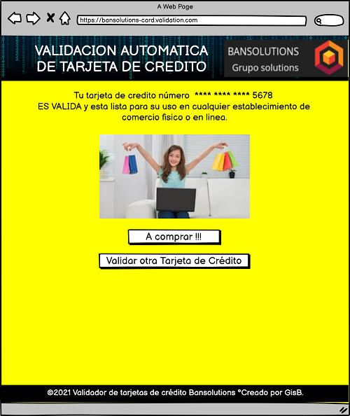
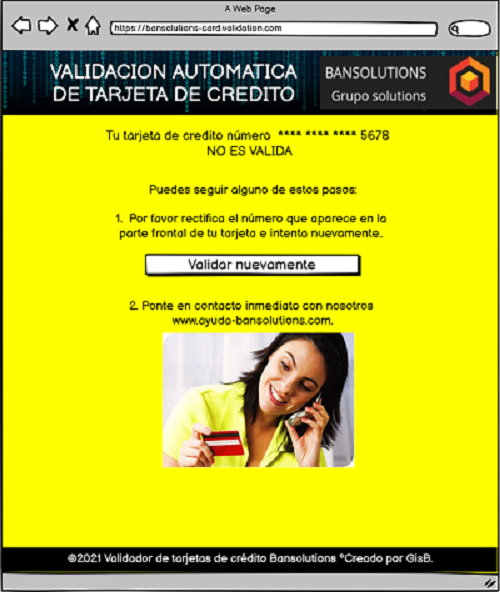

# Card Validation Project 1

## Índice

* [1. Resumen (Abstract)](##1-Resumen-(Abstract))
*[2. Imagen Final del Proyecto](##-2.-Imagen-Final-del-Proyecto)
* [3.Investigación UX (UX research)](##3.-Investigación-UX)
* [3.1. Usuarios y Objetivos del Producto (User and product goals)](###4-usuarios-y-objetivos-del-producto)
* [3.2. Cómo el producto resuelve los problemas/necesidades del usuario (How the product solves user problems/requirement)](#5-como-el-producto-resuelve-el-problema)
* [3.3. Primer Prototipo en papel (First Paper prototyping)](#6-primer-prototipo-en-papel)
* [3.4. Retroalimentación de Usuarios (User Feedback)](#7-retroalimentacion-de-usuario)
* [3.5. Prototipo Final (Final Prototype)](#8-prototipo-final)

***

## 1. Resumen (Abstract)
xxxxxxxxxxxxxxxxxxxxxxxxxxxxxxxxxxxxxxxxxxxxxxxxxxxxxxxxxxxxxxxxxxxxxxxxxxxxxxxxxxxxxxxxxxxxx

***

## 2. Imagen Final del Proyecto

***

## 3.Investigación UX (UX Research)

### 3.1. Usuarios y Objetivos del Producto (User and product goals)

Los usuarios de esta app web son personas jóvenes que reciben la tarjeta de crédito del banco "Bansolutions" que es nuestro cliente, son usuarios que reciben la tarjeta por primera vez y que no quieren incurrir en gastos innecesrios. 

El cliente de la app web es un "banco de bajo costo", que tampoco quiere incurrir en gastos adicionales, quiere manejar una imagen descomplicada y no tan rigida como los bancos tradicionales, por esta razón el banco envia sus tarjetas por sistema de correo normal pero al no ser correo certificado se pueden presentar problemas de fraude, principalmente en la situación que al usuario le llegue otro tipo de tarjeta que sólo sea para extraer datos del usuario y no sea una tarjeta de crédito válida. 

Por esta razón el objetivo del producto es poder decirle al usuario sí la tarjeta de crédito que recibió es válida o no, y que el usuario se sienta seguro que en efecto la tarjeta recibida si fue la tarjeta enviada por el banco.

***

### 3.2. Cómo el producto resuelve los problemas/necesidades del usuario (How the product solves user problems/requirement)

El producto es una app web que le pregunta al usuario su número de tarjeta y el usuario al ingresarla en el lugar indicado y dar click en validar, realiza en efecto este proceso de validación de su tarjeta de crédito, esta validacion se realiza por medio del Algoritmo de Luhn ó Algoritmo de módulo 10. Sí la tarjeta es válida le mostrará al usuario un mensaje diciendole que su tarjeta es válida pero si por el contrario no es válida el mensaje será que rectifique el número y vuelva a la válidación ó que se comunique con el banco para evitar fraudes.

***

### 3.3. Primer Prototipo en papel (First Paper prototyping)

***

### 3.4. Retroalimentación de Usuarios (User Feedback)

* Utilizar un estilo de letra fresco no rigido por el tipo de usuario y letras grandes para mejor accesibilidad.  

* Utilizar colores que resalten pero que a la vez se vean serios.  

* Tener coherencia entre los colores de la página y los colores del logo del banco y así mismo el estilo de letra que sea similar.  

* La página debe ser sencilla y fácil de entender para el usuario, en especial las instrucciones para validar la tarjeta.  

* Que el usuario entienda que tiene que hacer para evitar fraude "ponerse en contacto con el banco".  

* Procurar que la página no tenga mucho texto.  

***

### 3.5. Prototipo Final (Final Prototype)

Pagina de Inicio

Respuesta tarjeta válida

Respuesta tarjeta no válida

